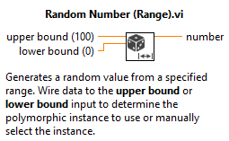
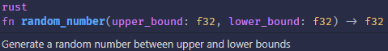
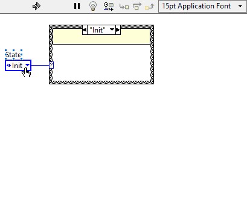
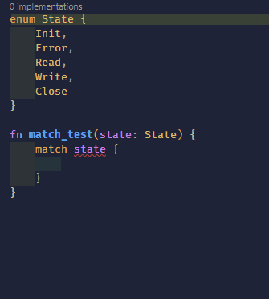

# Rust for LabVIEW Programmers

## Overview

As a LabVIEW Architect and someone who has made a career out of writing LabVIEW code for Windows, NI RT Linux and NI FPGA for over 10 years, I recently fell in love with the programming language Rust.  I have been branching out into new languages since I picked up my CLA three years ago - first JavaScript, then TypeScript, Python and lately Rust.  

Rust certainly has an intimidating reputation for its steep learning curve, but of all these languages I've found the greatest affinity for Rust.  I believe this is partly because it shares some crucial DNA with things I particularly enjoy about LabVIEW, and excels at some of the things I find most hard work with LabVIEW.  

I also think digging into how Rust works has made me a better LabVIEW programmer and appreciate where the language really excels.

---

## Things in Common

### Strict type system & Compile time checks

Rust's type system, particularly its numeric options, are pleasantly familiar.  I'm very used to thinking about the size and sign of numerics in LabVIEW and this always feels like a sacrifice in other languages like JavaScript only having a 'number' type and Python's 'float' or 'int' types.

```rust
let unsigned: u32 = 500;
let signed: i8 = -4;
let float: f32 = 3.1415;
```

In both Rust and LabVIEW, for a little bit of effort defining types, you get a lot of benefits to your developer experience in the form of compile time static-analysis and self-documenting code blocks.





### Data Ownership & Performance

I'm used to a broken run arrow or broken wire telling me my types aren't compatible and it can be frustrating that other languages will let you get away with things that they should know aren't going to work until runtime.  Rust's memory safety [borrowing and ownership](https://www.youtube.com/watch?v=DJdUjjOmyx8) goes even further than LabVIEW with its static analysis and assurance against things like race conditions, but the LabVIEW [Dataflow model](https://labviewwiki.org/wiki/Data_flow) does include some ownership concepts. Today, both languages use [LLVM](https://www.youtube.com/watch?v=BT2Cv-Tjq7Q) to compile developer code to bytecode, though I'd love to see more access to compiler customizations in LabVIEW that are [available in Rust](https://www.youtube.com/watch?v=b2qe3L4BX-Y):

```toml
[profile.release]
opt-level = "z"     # Optimize for size.
lto = true          # Enable Link Time Optimization
codegen-units = 1   # Reduce number of codegen units to increase optimizations.
panic = "abort"     # Abort on panic
strip = true        # Automatically strip symbols from the binary.
```

### Enums

Rust's handling of enums will be familiar to a labVIEW Programmer, both languages have them as a core datatype.  The state machine pattern is all over LabVIEW code, and enforcing that each case is handled explicitly or via a default is a big developer boon that Rust is equally pedantic about.





Rust goes a step further with enums though, by allowing you to add additional methods and data to enum states, which opens up a whole interesting world of possible design patterns.

```rust
enum State {
    Init,
    Error(Result<(), u32>),
    Read((u8, u32)),
    Write(Vec<u8>),
    Close,
}

fn match_test(state: State) {
    match state {
        State::Init => todo!(),
        State::Error(error) => todo!(),
        State::Read((channel, samples)) => todo!(),
        State::Write(bytes) => todo!(),
        State::Close => todo!(),
    }
}
```

### High-level assistance, but go as low as you need

The LabVIEW standard library is pretty packed with functions that help you solve common coding challenges, and whilst Rust's standard library contains less (by design) it is easily extended by libraries, called [crates](https://www.crates.io).  Because of their high performance compiler optimization and rich type systems, both languages give you the power to mix these high level functions with, for example, complex array or string manipulations necessary for data intensive applications.

### Error handling framework

One of the most common patterns in LabVIEW is the [error case statement](https://www.ni.com/docs/en-US/bundle/labview/page/lvhowto/using_case_structures_for.html), allowing us to turn on and off code blocks based on runtime errors and warnings.  This maps quite nicely to one of the core data types in Rust, the [Result](https://doc.rust-lang.org/std/result/) type.  LabVIEW dataflow enforces that developers account for the state and type of all variables exiting a case structure under all possible outcomes, like with our enum example, as does Rust.  Both languages having complex predictable error handling at the core of their design shows in their DNA.

```rust
enum Result<T, E> {
   Ok(T),
   Err(E),
}
```

---

## Wins for Rust

### Open-source

Of course, its hard to argue with the free pricetag on an open-source language, and one that is gaining more and more traction across [major tech companies](https://www.rust-lang.org/sponsors), even becoming the [second official language of Linux](https://www.techzine.eu/news/devops/69453/rust-emerges-as-linuxs-second-official-language/) recently.  [Stable](https://blog.rust-lang.org/2014/10/30/Stability.html) feature releases are on a regular 6 weekly cycle, preceeded by unstable (Nightly) releases for testing new features.  

The Rust community is welcoming, active and growing, and of course Rust keeps getting voted [most loved language](https://survey.stackoverflow.co/2022/?utm_source=thenewstack&utm_medium=website&utm_content=inline-mention&utm_campaign=platform#section-most-loved-dreaded-and-wanted-programming-scripting-and-markup-languages) on Stack Overflow. LabVIEW isn't even on the board, which I've always found gives me a chip on my shoulder as a programmer.

### Run anywhere

Rust code compiles to a binary, as does LabVIEW, however it has no external runtime dependency and can be compiled to run on Windows, Linux, Mac, Mobile, and embedded chips such as the STM32.  Frameworks like [Tauri](https://tauri.app/) create standalone cross-platform GUI applications using web-rendering technology built in to all modern Operating Systems.  This is something I'd love to see better supported in future LabVIEW releases.

### Library ecosystem

One of my major bugbears with LabVIEW these days is the difficulty creating isolated environments to develop code.  When it was first designed, globally installing libraries was the done thing, but this makes library version management painful, especially if working across multiple versions of LabVIEW.  Rust libraries are all installed and managed on a project by project basis, via a cargo.toml file that specifies the external libraries used and their versions.

### IDEs and source-control

Text based programming comes with knock-on benefits by playing nicely with all major IDEs and source-control systems.  Though this isn't unique to Rust, it is a significant way in which  LabVIEW shows its age and isn't able to easily take advantage of new any innovations (tried asking chatGPT to write labVIEW code?).  This also applies to linting and auto-formatting of code, which is core in Rust and noticeably bolted on in LabVIEW.

---

## Wins for LabVIEW

### Lower skill floor

The learning curve is there with Rust. Though it also exist for LabVIEW, it is definitely easier to get started building and running an application, which is what has made LabVIEW so accessible for Engineers and Scientists without a Computer Science background.  The skill requirement gap is largest when dealing with User Interfaces, with LabVIEW's drag and drop graphical interface.  

However, with its non-vector graphics, there definitely comes a crossover where you begin fighting with LabVIEW to create more complex, dynamic interfaces - whether this is necessary in Test & Measurement is open for debate.

### Parallelism

LabVIEW has been described as a "massively parallel" language. It is trivial to write code that executes in parallel to other code (in-fact beginners have to be taught how to enforce execution order).  This requires more effort in any text based language and is less obvious to visualize even when it does work.

### Hardware ecosystem

The biggest thing in LabVIEW's favour is its catalogue of APIs to many common hardware types, this being the bread and butter of Test & Measurement activities, as well as native integration with NI DAQ, RIO, PXI, FPGA, etc.  This requires maintaining by NI however, and it is noticable that more companies are opting for supporting Python APIs and foregoing LabVIEW support than was the case a few years ago.
